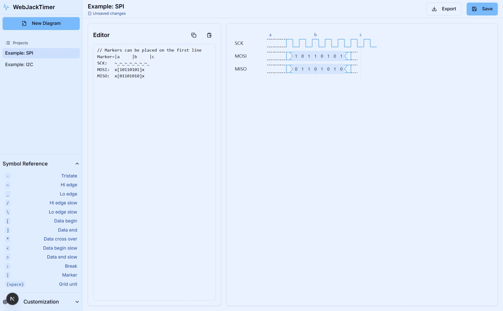

# Simple Timing Diagram

A modern, web-based timing diagram generator that converts simple text syntax into clean, professional SVG/PNG diagrams. Powered by Next.js.



## Features

- **Text-to-Diagram**: Define signals and markers using a simple, intuitive syntax.
- **Instant Preview**: See your changes in real-time as you type.
- **Export Options**: Download your diagrams as SVG or PNG files.
- **Predefined Examples**: Get started quickly with built-in SPI and I2C examples.

## Getting Started

### Prerequisites

- Node.js 20+
- pnpm (Recommended) or npm

### Installation

1. Clone the repository.
2. Install dependencies:
   ```bash
   pnpm install
   ```

### Running Locally

Start the development server:
```bash
pnpm run dev
```
The application will be available at `http://localhost:9002`.

## Timing Diagram Syntax

### Basic Signals
- `~`: Transition/Clock
- `_`: Low level
- `/`: High level
- `x`: Undefined/Bus
- `[...]`: Data value

### Markers
Place markers on the first line to label specific time points:
```text
Marker=|a     |b     |c
```

### Example: SPI
```text
Marker=|a     |b     |c
SCK:   ~_~_~_~_~_~_~_
MOSI:  x[10110101]x
MISO:  x[01101010]x
```

## Tech Stack

- **Framework**: Next.js 15
- **UI Components**: Radix UI + Tailwind CSS
- **Icons**: Lucide React

